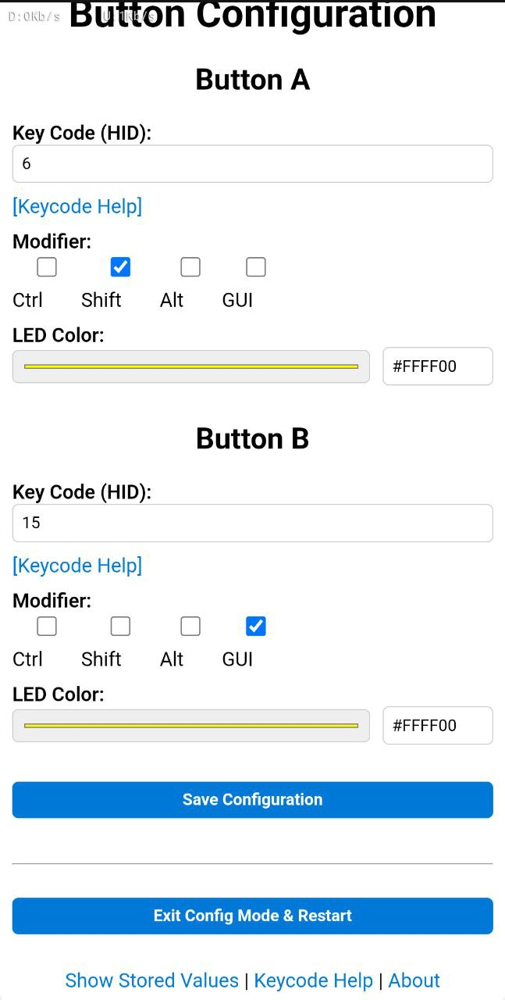

# ESP32-KeyMaster

A customizable keyboard shortcut device based on the ESP32-S3 Mini. This project allows you to create custom keyboard shortcuts using two buttons and configure them through a web interface. 🎮✨

## Features

- Two configurable buttons for custom keyboard shortcuts
- Web-based configuration interface
- LED feedback for button states
- Support for key combinations (e.g., Ctrl+C, Alt+Tab)
- Persistent storage of configurations
- Access Point mode for configuration
- Modern, responsive web interface

## Hardware Requirements

- ESP32-S3 Mini development board
- 2 push buttons
- 1 RGB LED (WS2812B/NeoPixel)
- USB cable for power and data
- Optional: Case/Enclosure

## Pin Configuration

- Button A: GPIO 1
- Button B: GPIO 3
- LED: GPIO 47

## Installation

1. Clone this repository
2. Open the project in PlatformIO
3. Connect your ESP32-S3 Mini
4. Upload the code
5. Connect to the "ESP32-KeyMaster" WiFi network
6. Open the configuration page in your browser

## Usage

### Normal Mode
- Short press Button A: Sends configured key combination A
- Short press Button B: Sends configured key combination B
- Long press Button B (5 seconds): Enters configuration mode

### Configuration Mode
1. Long press Button B for 5 seconds
2. Connect to the "ESP32-KeyMaster" WiFi network
3. Open the configuration page in your browser
4. Configure your desired key combinations
5. Save the configuration
6. Exit configuration mode

## Configuration Options

- Key codes (letters, numbers, function keys)
- Modifier keys (Ctrl, Shift, Alt, GUI)
- LED colors for each button
- All settings are saved permanently

## Web Interface

The web interface provides:
- Easy configuration of key combinations
- Color picker for LED settings
- Debug information
- Help page with key code reference
- About page with version information



## Project Structure

```
ESP32-KeyMaster/
├── Epics/                    # Main folder for all Epics
│   ├── Epic01_Hardware/     # Hardware-related user stories
│   │   ├── Button_Implementation.md
│   │   ├── LED_Implementation.md
│   │   └── USB_HID_Implementation.md
│   ├── Epic02_Configuration/# Configuration interface
│   │   ├── Web_Interface.md
│   │   ├── WiFi_Setup.md
│   │   └── Storage_Implementation.md
│   ├── Epic03_Keyboard/     # Keyboard functions
│   │   ├── HID_Protocol.md
│   │   ├── Key_Mapping.md
│   │   └── Modifier_Support.md
│   ├── Epic04_Usability/    # UI/UX aspects
│   │   ├── LED_Feedback.md
│   │   ├── Button_Behavior.md
│   │   └── Web_UI_Design.md
│   ├── Epic05_Stability/    # Stability and maintainability
│   │   ├── Error_Handling.md
│   │   ├── Power_Management.md
│   │   └── Code_Structure.md
│   └── Epic06_Extensions/   # Future extensions
│       ├── Multi_Button_Support.md
│       ├── Profiles_Support.md
│       └── OTA_Updates.md
├── src/                     # Source code
│   └── main.cpp            # Main application code
├── platformio.ini          # PlatformIO configuration
├── LICENSE                 # MIT License
└── README.md              # Project documentation
```

## Development

This project is built with:
- PlatformIO
- Arduino Framework
- ESP32-S3 Arduino Core
- Adafruit NeoPixel library
- ESP32 WebServer library

## License

This project is licensed under the MIT License - see the LICENSE file for details.

## Contributing

Contributions are welcome! Please feel free to submit a Pull Request.

## Credits

- ESP32-S3 Arduino Core Team
- Adafruit for the NeoPixel library
- All contributors and users of this project 🚀 